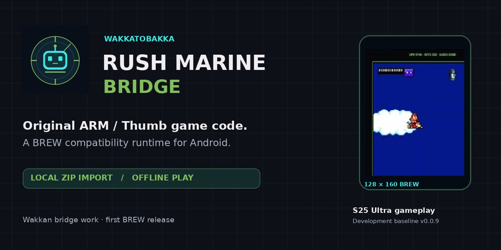

# Rush Marine Bridge

Rush Marine Bridge is an independent Android compatibility bridge for running a user's own compatible copy of **Mega Man: Rush Marine**, the English BREW 1.1.11 / CDM2030 128×160 release, on modern Android hardware.

**Current public baseline:** v0.1.2 — pre-release  
**Android:** 8.0 or newer  
**Package:** `com.wakka.omnibridge.rushmarine`

## Current status

Rush Marine Bridge keeps the original game doing the gameplay and rebuilds the BREW phone environment it expects around it.

The current release has been tested on a Samsung Galaxy S25 Ultra / Android 16 with the game booting and running with rendering, audio, touch controls, and runtime report export working in the portions tested.

Saving progress across fresh app launches is not finished yet, and this is still a pre-release.

This repository contains the bridge/runtime source and build-support material only. **No Mega Man: Rush Marine game files are included.**

## Why Rush Marine Bridge exists

Dirge Bridge, DeadShot Bridge, and FFVII Snowboarding Bridge were about getting old DoJa games running on modern Android.

Rush Marine is the same basic idea aimed at **BREW** instead.

The original game already exists. The problem is that it was built for a phone environment that modern Android does not provide. Rush Marine Bridge rebuilds that missing layer so the preserved game can run on a modern phone.

This is my first public BREW bridge.

## What works

- Original game logic running through the bridge
- Original 128×160 BREW game presentation
- Local user-supplied game-data import
- Exact game-file size and SHA-256 verification
- Touch controls for movement and game actions
- Original phone-key input support
- Game audio
- Runtime diagnostics and report export
- Offline play after successful import

## Play it

1. Download `Rush_Marine_Bridge_v0.1.2.apk` from **Releases**.
2. Install it on your Android phone.
3. Open Rush Marine Bridge and tap **IMPORT RUSH MARINE ZIP**.
4. Select your own compatible preserved BREW game ZIP. Leave it zipped.
5. After verification succeeds, tap **ENTER RUSH MARINE**.

The supported original archive is commonly named `Mega-Man-Rush-Marine_BREW_EN_Capcom-1111.zip`. The archive filename does not need to match exactly; Rush Marine Bridge verifies the required game files by their expected sizes and SHA-256 hashes.

If you only have the extracted game files, the optional **Game Data ZIP Helper** included with the release can package them locally into the format Rush Marine Bridge expects.

## Game data

Rush Marine Bridge does not include or download the original game.

Import is performed locally on the phone, and the bridge verifies the required game files before allowing them to run.

See [`GAME_DATA.md`](GAME_DATA.md) for the supported file set and verification details.

## Known limit

**Save persistence across fresh app launches is not finished yet.**

The bridge is still a pre-release, so later-game issues may also exist outside the portions tested so far.

## Project docs

- [`ARCHITECTURE.md`](ARCHITECTURE.md) — how the bridge is put together
- [`BUILDING.md`](BUILDING.md) — building the Android app
- [`DEVELOPMENT_HISTORY.md`](DEVELOPMENT_HISTORY.md) — project history
- [`GAME_DATA.md`](GAME_DATA.md) — supported game-data requirements
- [`MIGRATION_NOTES.md`](MIGRATION_NOTES.md) — bridge migration notes

## Scope and affiliation

Rush Marine Bridge is an unofficial preservation/compatibility project. It is not affiliated with or endorsed by Capcom or Qualcomm.

Mega Man and related game content belong to their respective rights holders.

No repository-wide license has been selected yet.
